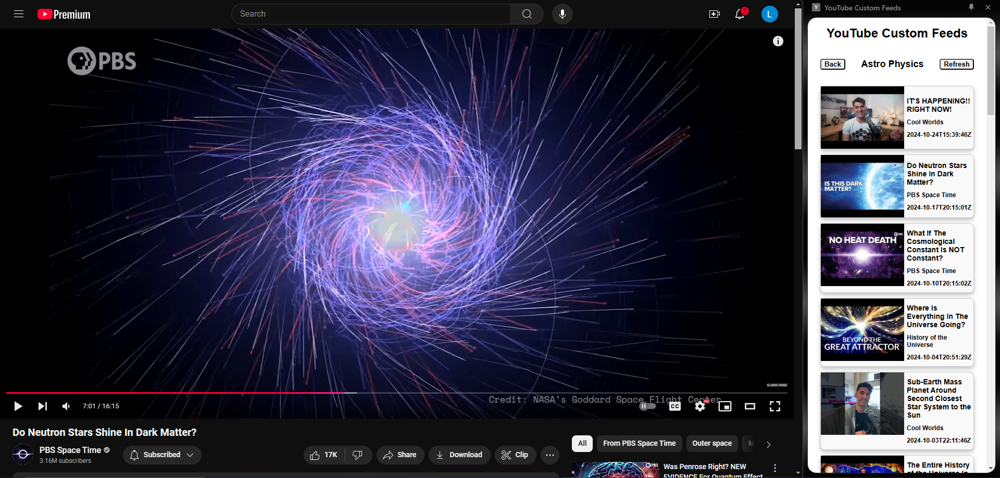

# YouTube Custom Feeds

A Chrome extension that allows you to create personalized YouTube feeds containing content 
only from channels that you select. Once feeds are created, you can view a list of recent 
videos from all channels in the feed. 

## Getting Started

Simply head to the link below and install the extension in your chrome browser.

> **[Install from Chrome Web Store](https://chromewebstore.google.com/detail/youtube-custom-feeds/hihmkocmnjddomhngmmpkdidkmpkneea)**

## Table of Contents

1. [Description](#description)
2. [Project Structure](#project-structure)
3. [Current Status](#current-status)
4. [Future Plans](#future-plans)
5. [License](#license)

## Description

Take control of your YouTube browsing with custom feeds tailored to your interests. This extension allows you to create personalized feeds that showcase recent videos from selected channels. Instead of sifting through every new upload, organize your subscriptions into separate feeds. Create a feed just for fitness videos, another for science and educational content, or even a dedicated feed with channels your kids enjoy. Switch easily between feeds in a user-friendly side panel to see only the videos you want, when you want. Perfect for a streamlined and customized YouTube experience.

## Project Structure

- **Backend**: Built with Golang and hosted on Google Cloud Run. It uses a PostgreSQL database hosted on Google Cloud SQL.
- **Frontend**: Developed with vanilla JavaScript, HTML, and CSS for a responsive and simple user interface.
- **Authentication**: Firebase Authentication for secure access. 

## Current Status

Core functionality and features are almost entirely implemented including:
- User Authentication using Firebase Authentication (only email and password).
- Account deletion(including any data stored in the backend)
- Feed Creation and naming.
- Adding and removing channels from feeds.
- Retrieving recent uploads from channels in a feed.
- User feed storage in backend, allowing continuity between logins.

## Future Plans

Features to be implemented and work to be done:
- Firebase Anonymous Authentication (allows a user to try out the features without creating an account).
- Full Firebase Authentication (ability to sign up and login with Google, Github, etc.,)
- Feed renaming (implemented on backed, need front end support).
- Ability to change how videos in a feed are ordered (currently ordered by upload date, favors channels that upload more frequently as they will have more videos at the top of the feed).
- Front end technical polishing. Currenty functional, but has some quirks (for instance, somtimes backs out of video view to feed view when loading first youtube video link in current tab).
- Front end aesthetic polishing (currently very plain, could use a fresh coat of paint).
- Expansion to other platforms/form factors (stand alone webpage, Firefox extension, app, etc.,).

## License

This project is licensed under the MIT License.
